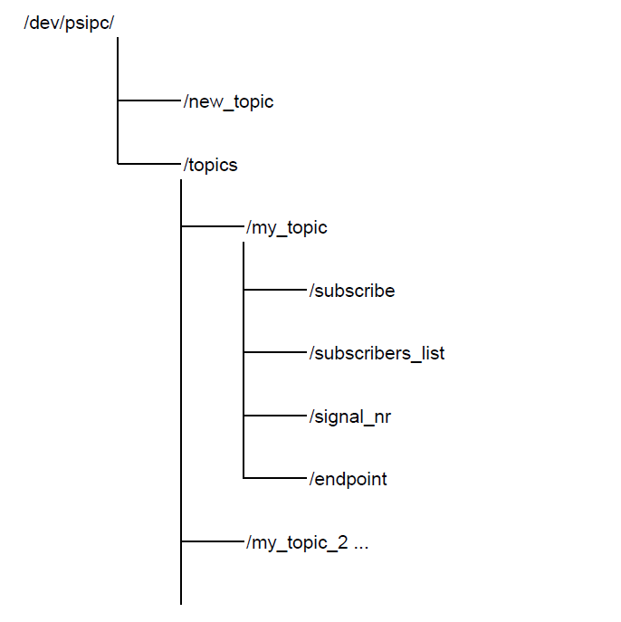

# Publisher-Subscriber IPC Kernel Module
This project consists in the development of a kernel module for Linux systems that implements the **publisher-subscriber** design pattern for inter-processes communication. 

The module is the final result of _Advanced Operating Systems_ course in _Computer Science & Engineering Master Degree_ at Politecnico di Milano, Italy.

* Project supervisor: Federico Reghenzani
* Course head professor: Vittorio Zaccaria
* Student developers: [Ottavia Belotti](https://github.com/OttaviaBelotti) and [Riccardo Izzo](https://github.com/RiccardoIzzo)

## Module Injection
From terminal, run the given [Makefile](https://github.com/RiccardoIzzo/AOS-Publisher-Subscriber-IPC/blob/main/Makefile) in the project directory to compile the C source code into the `psipc_module.ko` kernel object file.
```Shell
make
```

After compilation, to insert the module in the current system:
```Shell
#optional: clean the kernel log before insertion
sudo dmesg -C
sudo insmod psipc_module.ko
```

Once it is not needed anymore, remove it with:
```Shell
sudo rmmod psipc_module
```

## Purpose of the project & How to use it
The module creates a tree-structure in the /dev directory that, once the module has been loaded succesfully, will resemble the one proposed below.

A user process that acts as a publisher has to request the creation of the desired topic by writing its name on the `new_topic` file (in /dev/psipc). The module creates a new directory specific to that topic with all the necessary files related to it: `subscribe`, `subscribers_list`, `signal_nr` and `endpoint`.
Once this has been set up, other user processes running under the same user space as the publisher can:
* Subscribe to the topic: writing 

## Development Environment
The module has been developed in **Ubuntu 20.04 LTS** distro with development tools on a Virtual Machine. 

Kernel version: v5.11
## Tools & Reference Material
* [The Linux Kernel Module Programming Guide](https://sysprog21.github.io/lkmpg/) - by Peter Jay Salzman, Michael Burian, Ori Pomerantz, Bob Mottram, Jim Huang
* [Linux](https://github.com/torvalds/linux) - Linus Torvalds official repository on GitHub
* [Bootlin Elixir Cross Referencer](https://elixir.bootlin.com/linux/v5.11.22/source) - to explore in an easier way the Linux source code
* [Oracle VM VirtualBox](https://www.virtualbox.org/)
